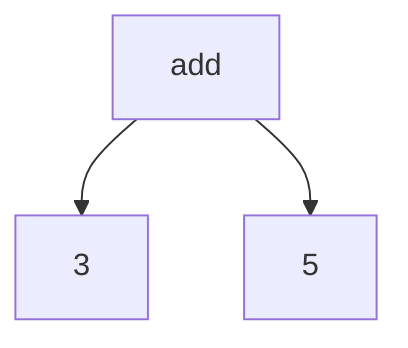
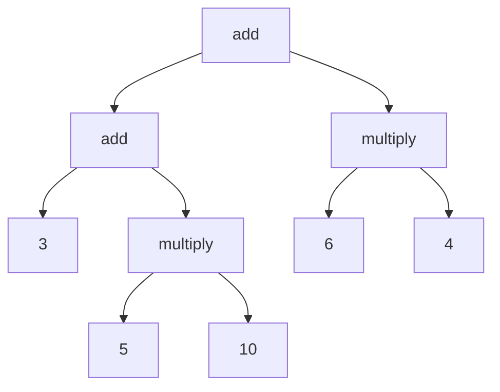

# S-expressions

S-expression is an expression to represent a tree-structured data. Read more about [s-expressions](https://en.wikipedia.org/wiki/S-expression).

# Our grammar

The point of this mini-interpreter is to be as simple as possible. The goal is not a industrial strength interpeter but rather to understand evaluation of s-expressions. So, for the sake of simplicity, our language only supports three binary operators: `+`, `-`, `*`. We assume the `+` and `-` operators can only be binary for the sake of simplicity. Here is the grammar for our tiny language. 
Anything within double quotations is a terminal and anything not within double quotations is a variable. Our starting variable is `expr`. Below are the production rules:

TODO

# Parser

In our case, we can represent math expressions with a s-expression. For example, `3 + 5` is equivalnent to `(+ 3 5)`

A complex expression like `3 + (5 * 10) + (6 * 4)` would be equivalent to `(+ (+ 3 (* 5 10)) (* 6 4))`

S-expression is already a way to represent a tree. So, our job is very easy as we only need a way to represent this tree in our program. So, our parser for this tiny s-expression language would "create" a parse tree like shown above ! 

## Interpreter

We start with the `root` node. Interpreting any node would mean the following for our language:
* If the node is a leaf node, we just evaluate the literal constant(number).
* If the node is not a leaf node, it must have two child nodes. We evaluate the left child node `a` first, and then the right child node `b`. Finally, once we evaluate both the child nodes, we use our operator `op` and evaluate the required value which is `a op b`.
