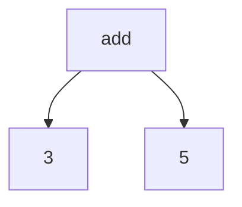
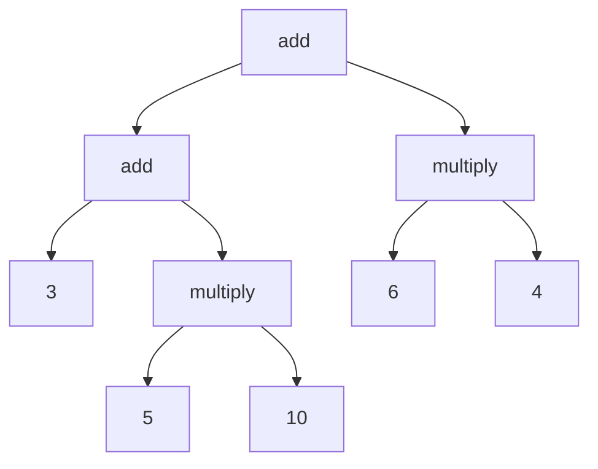

# Build you own mini-interpreter for S-expressions

## What is this?

This repository contains code for a "mini-interpreter" to handle s-expressions. My goal with this project is for this to serve as a stepping stone for someone wanting to build their own compiler or interpreter. I believe this project will help gain some experience before making an interpreter or a compiler for a toy language or beyond. <br>

I use `python` for this so that it is easy to follow for anyone. I also decided to build an interpreter with the parser building an abstract representation rather than targeting machine code so that it is easy to follow. 

## S-expressions

S-expression is an expression to represent a tree-structured data. Read more about [s-expressions](https://en.wikipedia.org/wiki/S-expression) or head to the [Parser](https://github.com/paudsu01/S-expression/#parser) section to understand more.

## Grammar

The point of this mini-interpreter is to be as simple as possible. The goal is not a industrial strength interpeter but rather to understand evaluation of s-expressions. <br><br>
So, for the sake of simplicity, our language only supports three binary operators: `+`, `-`, `*`. We assume the `+` and `-` operators can only be binary for the sake of simplicity. Here is the grammar for our tiny language:
<br><br>
Anything within double quotations is a terminal and anything not within double quotations is a variable(non-terminal). Exception being `NUMBER` which is a terminal as well where `NUMBER` matches the regex `[0-9]+`. Our starting variable is `expr`. Below are the production rules:

```
expr -> "(" operator expr expr ")" | literal 
literal -> NUMBER
operator -> "+" | "-" | "*" 
```

All the production rules fit within 3 lines which resonates with our philosophy of making this as simple as possible. So, as per our production rules, even the empty s-expression `( )` is not a valid production. 

So, for our interpreter, valid programs include `5`, `( + 5 10 )` etc.

## Scanner
The core of the scanner is a loop. We start with the first character, decide which token the character belongs to and so on. Based on a character, we might need lookaheads to determine the token type and value like for `NUMBERS`. We ignore white spaces. The program basically uses a "switch" (if-elif-else since python doesn't support switch) statement to create tokens while reading the source code input. We have 6 tokens:
- `TOKEN_LEFT_PAREN` for "("
- `TOKEN_RIGHT_PAREN` for ")"
- `TOKEN_ADD` for "+"
- `TOKEN_SUBTRACT` for "-"
- `TOKEN_MULTIPLY` for "*"
- `TOKEN_NUMBER` for  `NUMBER`
  
## Parser

In our case, we can represent math expressions with a s-expression. For example, `3 + 5` is equivalent to `(+ 3 5)` in S-expression.



A complex expression like `3 + (5 * 10) + (6 * 4)` would be equivalent to `(+ (+ 3 (* 5 10)) (* 6 4))`



S-expression is already a way to represent a tree data. So, our job is very easy as we only need a way to represent this tree in our program. So, our parser for this tiny s-expression language would "create" a parse tree like shown above ! I use recursive decsent parsing to this implementation and at its core, this is just implementing the rules of our grammar with functions for each non-terminal production rules. I recommend this [video](https://www.youtube.com/watch?v=KRbzEaUmog8) to understand more. 

## Interpreter

We start with the `root` node. Interpreting any node would mean the following for our language:
* If the node is a leaf node, we just evaluate the literal constant(number).
* If the node is not a leaf node, it must have two child nodes. We evaluate the left child node `a` first, and then the right child node `b`. Finally, once we evaluate both the child nodes, we use our operator `op` and evaluate the required value which is `a op b`.

## Code

* Now that we have gone over the implementation idea, I would advise looking at the `main.py` file first to understand the overall structure of the program.
* I would then advise looking at `scanner/scanner.py` to understand how tokens are being generated and returned back.
* The next step would be looking at `parser/tree.py` to understand what a `node` class contains which is what we will use for our abstract representation.
* Look at `parser/parser.py` to see the implementation for our recursive descent parser.
* Finally, look at `interpreter/interpreter.py` to understand how are evaluating the parse tree.
  
## What next?

I would recommend forking the repository and cloning the forked repository first so that you can understand, modify and enhance the code.  
There are a number of ways you can go from here.
* Try to understand what is going on from scanning to parsing to interpreting. Try to look at the abstract representation of our code after parsing using a `breakpoint()` or so.
* Change the grammar and implementation to support unary s-expressions like `(- 5)` or `(+ 4)` because as of now, we would need to use `(- 0 5)` to evaluate `-5`. It would be nice to just have `(- 5)` s-expression evaluate to `-5`.
* Support division as an operator. Moreover, you can also try supporting strings and operations like string concatenation using `(+ "aaa" "bbb")` which should evaluate to `"aaabbb"`
* I have used the simple and efficient recursive descent parser for this implementation. However, since our grammar is small and context-free, this would be a great time to try other parsing methods like bottom-up parsers and so on. 
* Add more robust error-handling and support error sychronization. Right now, as soon as there is a single error, we abort our program.
* Add any features as you wish. The point is to explore new ideas !!

The most obvious next step if you think you are ready would now be building your own interpreter and then a compiler for the [Lox](https://craftinginterpreters.com/) language. It is a great book, and I hope you will fall in love with it just like me and many others. 

## Contributions

The whole point of this project is to keep it simple for newbies to follow. So, please do not try to contribute by adding new features. However, feel free to enhance/correct code implementation and this README if you find any errors/ typos or even better ways to implement something which you believe will help the reader.
Follow this guide [here](https://docs.github.com/en/get-started/exploring-projects-on-github/contributing-to-a-project) to get started. 

